# Hi there 👋, I'm

### Logic bug hunter & security researcher

*Specializing in auth, access control & trust-boundary flaws*
 
*Turning unsafe assumptions into actionable PoCs*

---

  
  &nbsp;
  

 

